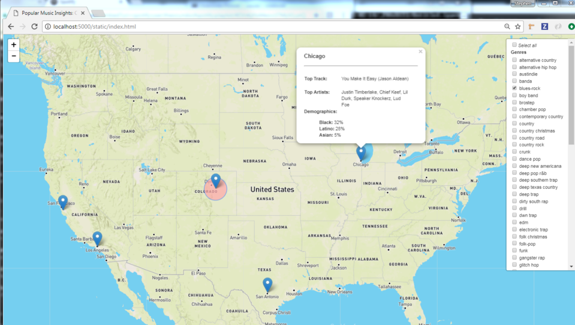
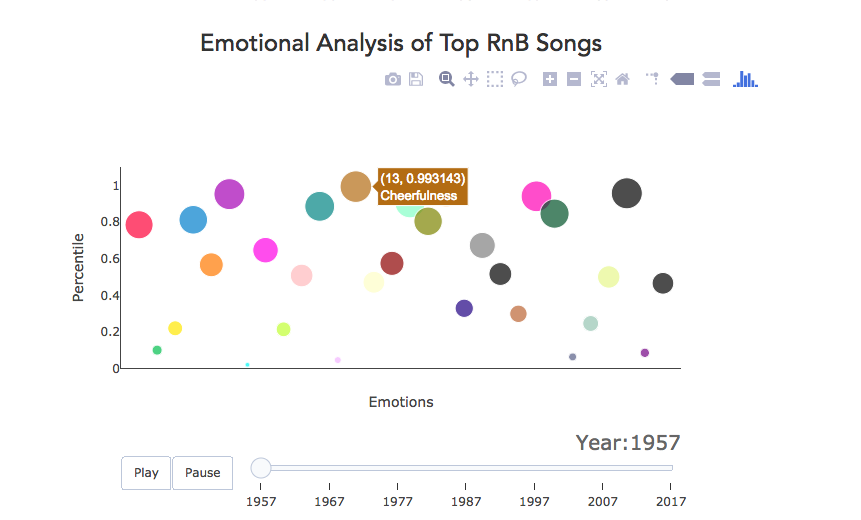

#  Popular Music Insights


## Analysis and visualization of music - by artists, songs, genres, lyrics, demographics, race and gender.

**Project Title:** 
Popular Music Insights

**Project Outline:**

I. A geographical examination of the musical preferences across 15 cities -- filtered by artist genre, race, and gender -- based on Spotify streaming frequency. 
* Example of the interactive map that examines the musical preferences for particular cities


II. Emotional influences and lyrical content mapped by analysis of 70 years of top-charting Billboard songs by genre. 
* Example of the emotional attributes of hit songs over the last 70 years: 


**Technology used:**

* [Spotipy API for Spotify](spotipy.readthedocs.io/en/latest/#api-reference)
* [Flask](http://flask.pocoo.org/docs/0.12/quickstart/) and [Flask-PyMongo](https://flask-pymongo.readthedocs.io/en/latest/)
* [Leaflet.js](http://leafletjs.com/)
* [Watson Personality Insights API](https://www.ibm.com/watson/developercloud/personality-insights/api/v3)
* [Splinter](https://splinter.readthedocs.io/en/latest/)
* [Beautiful Soup](https://www.crummy.com/software/BeautifulSoup/bs4/doc/)
* [Lyrics Wiki](http://lyrics.wikia.com)
* [Wordcloud Library](http://amueller.github.io/word_cloud/)
* Pandas
* Numpy
* HTML, CSS, JS
* MongoDB

# File Descriptions

```emotion_analysis```
Data retrieval and analysis of lyrics data supporting the Plotly bubble charts in ```vis_integration/static/bubble_charts``` 
* country
  * billboard_country.csv
  	* top country hits and lyrics
  * country_bub_form.csv
  	* Output from country_bubble.ipynb
  * country_bubble.ipynb
  	* Converts country_combined.csv into format for bubble plot. 
  * country_combined.csv
  	* Output from country_exploration.ipynb
  * country_exploration.ipynb
  	* Takes country_lyr_results and combines together into one source in country_exploration.ipynb and stored as output in country_combined.csv
  * country_to_watson.ipynb
  	* Watson Personality Insights API call and analysis. Converts billboard_country.csv into country_lyr_results.
  * country_lyr_results
  	* Output from Watson API

* Pop
  * billboard_pop.csv
  	* top pop hits and lyrics
  * pop_bub_form.csv
  	* Output from pop_bubble.ipynb
  * pop_bubble.ipynb
  	* Converts pop_combined.csv into format for bubble plot. 
  * pop_combined.csv
  	* Output from pop_exploration.ipynb
  * pop_exploration.ipynb
  	* Takes pop_lyr_results and combines together into one source in pop_exploration.ipynb and stored as output in pop_combined.csv
  * country_to_watson.ipynb
  	* Watson Personality Insights API call and analysis. Converts billboard_pop.csv into pop_lyr_results.
  * pop_lyr_results
  	* Output from Watson API

* R&B
  * billboard_rnb.csv
  	* top rnb hits and lyrics
  * rnb_bub_form.csv
  	* Output from rnb_bubble.ipynb
  * rnb_bubble.ipynb
  	* Converts rnb_combined.csv into format for bubble plot. 
  * rnb_combined.csv
  	* Output from rnb_exploration.ipynb
  * rnb_exploration.ipynb
  	* Takes rnb_lyr_results and combines together into one source in rnb_exploration.ipynb and stored as output in rnb_combined.csv
  * country_to_watson.ipynb
  	* Watson Personality Insights API call and analysis. Converts billboard_rnb.csv into rnb_lyr_results.
  * rnb_lyr_results
  	* Output from Watson API

### Integration folders

```vis_integration```
* Integration of all parts for final presesntation and app.py for flask deployment 
```spotify_data```
* Data retrieval, analysis, and storage of artist, genre, song, gender, race, and city demographic data, in support of the interactive Leaflet.js map. 

### Additional Information

```proposal_img```
* Inspirational images for the project
```readmeimg```
* Images used for this Readme

### Development folders

```frontend```
* Leftover branch for front end development
```visualizations```
* Test folder for front end changes


