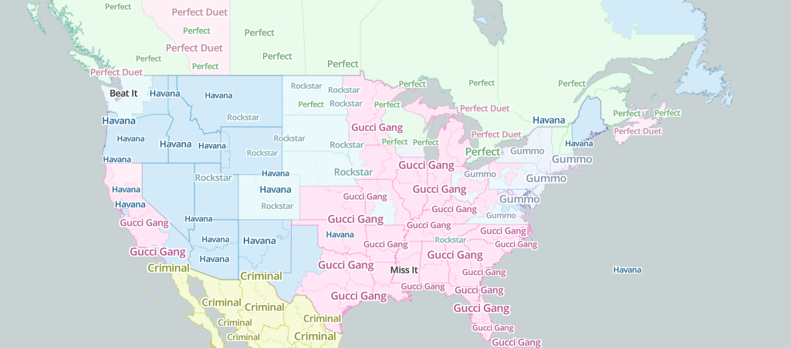
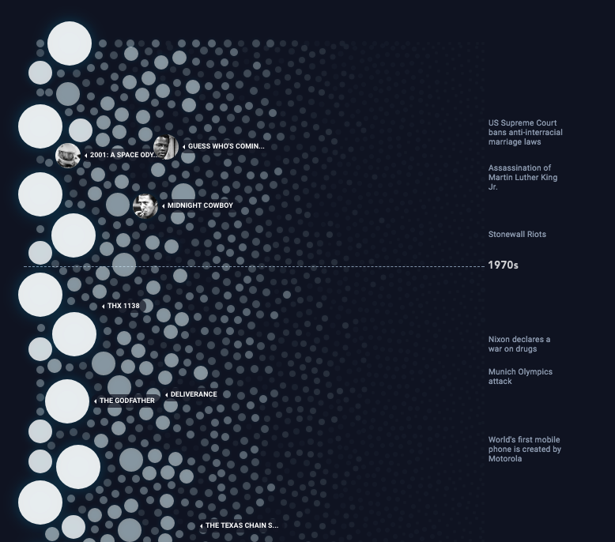
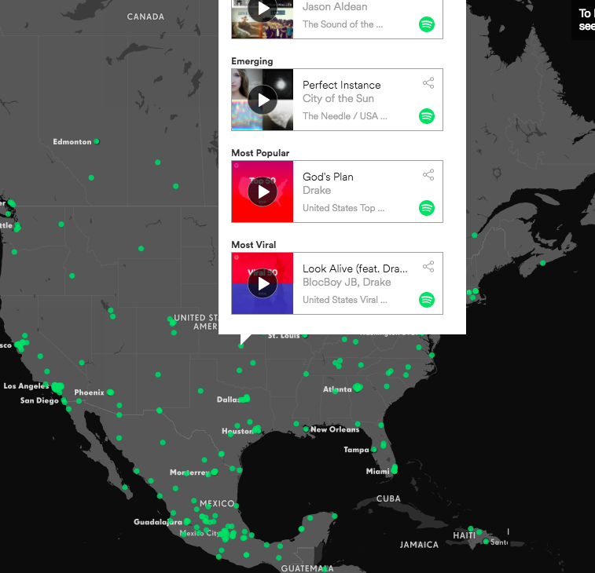

# Prpoject_2

<h1>Team:</h1>
Sophie Tsai
John Swyers
Stephen Schadt
Anais Dotis-Georgiou

<h1>Chosen Topic and Rationale:</h1>

<h1>Measuring music artist popularity by country (e.g., top 5 most popular artists)</h1>
-* Visualization would be a Leaflet-style overlay map, displaying metadata on hover over region
-* Filter map results by genre, gender, and/or race
-* Possibly provide sales data of artist or genre

<h1>Sentiment analysis of lyrics by country</h1>
-* Optional filter by year to visualize differences in sentiment analysis
-* Possible scrape lyrics into db

<h1>APIS, Libraries, and Resources:</h1>
-* Spotify API
-* LastFM API
-* YouTube  API
-* Dimple
-* Chart.js
-* BeautifulSoup 
-* SQLlite
-* YES API

<h1>Inspiring Visualizations:</h1>

