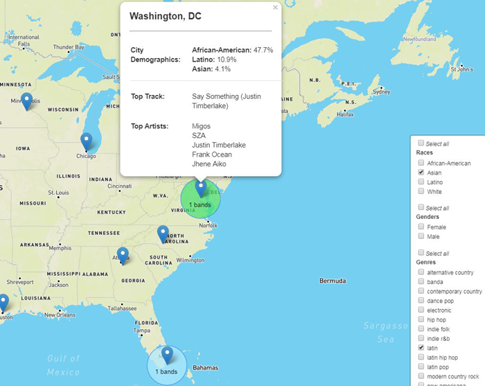

#  Popular Music Insights


## Analysis and visualization of musical tastes by artists, songs, genres, lyrics, demographics, race, and gender

**View the [Deployed app on Heroku](https://mighty-taiga-44531.herokuapp.com/static/Index.html).**

### Outline

I. A geographical examination of the musical preferences across 15 cities -- filtered by artist genre, race, and gender -- based on Spotify streaming frequency. 
* Example of the interactive map that examines the musical preferences for particular cities


II. Emotional influences and lyrical content mapped by analysis of 70 years of top-charting Billboard songs by genre. 
* Example of the emotional attributes of hit songs over the last 70 years: 


### Technologies Employed

* [Spotipy API for Spotify](http://spotipy.readthedocs.io/en/latest/#api-reference)
* [Flask](http://flask.pocoo.org/docs/0.12/quickstart/) and [Flask-PyMongo](https://flask-pymongo.readthedocs.io/en/latest/)
* [Leaflet.js](http://leafletjs.com/)
* [D3.js](http://d3js.org)
* [Watson Personality Insights API](https://www.ibm.com/watson/developercloud/personality-insights/api/v3)
* [Splinter](https://splinter.readthedocs.io/en/latest/)
* [Beautiful Soup](https://www.crummy.com/software/BeautifulSoup/bs4/doc/)
* [LyricWiki](http://lyrics.wikia.com)
* [Wordcloud Library](http://amueller.github.io/word_cloud/)
* Pandas
* Numpy
* HTML + CSS + JavaScript
* MongoDB

# File Descriptions

**[wordcloud_data](https://github.com/Anaisdg/Popular_Music_Insights/tree/master/wordcloud_data)**

Data retrieval and analysis of lyrics from [lyrics.wikia.com](http://lyrics.wikia.com) scraped HTML; generation of word cloud images from WordCloud (using matplotlib/Python).

**[emotion_analysis](https://github.com/Anaisdg/Popular_Music_Insights/tree/master/emotion_analysis)**

Data retrieval and analysis of lyrics data supporting the Plotly bubble charts in ```vis_integration/static/bubble_charts```

* ```country```
  * ```billboard_country.csv``` Top country hits and lyrics
  * ```country_bub_form.csv``` Output from country_bubble.ipynb
  * ```country_bubble.ipynb``` Converts country_combined.csv into format for bubble plot. 
  * ```country_combined.csv``` Output from country_exploration.ipynb
  * ```country_exploration.ipynb``` Takes country_lyr_results and combines together into one source in country_exploration.ipynb and stored as output in country_combined.csv
  * ```country_to_watson.ipynb``` Watson Personality Insights API call and analysis. Converts billboard_country.csv into country_lyr_results.
  * ```country_lyr_results``` Output from Watson API

* ```pop```
  * ```billboard_pop.csv``` top pop hits and lyrics
  * ```pop_bub_form.csvOutput``` from pop_bubble.ipynb
  * ```pop_bubble.ipynb``` Converts pop_combined.csv into format for bubble plot. 
  * ```pop_combined.csv``` Output from pop_exploration.ipynb
  * ```pop_exploration.ipynb``` Takes pop_lyr_results and combines together into one source in pop_exploration.ipynb and stored as output in pop_combined.csv
  * ```country_to_watson.ipynb``` Watson Personality Insights API call and analysis. Converts billboard_pop.csv into pop_lyr_results.
  * ```pop_lyr_results``` Output from Watson API

* ```rnb```
  * ```billboard_rnb.csv``` Top R&B hits and lyrics
  * ```rnb_bub_form.csv``` Output from rnb_bubble.ipynb
  * ```rnb_bubble.ipynb``` Converts rnb_combined.csv into format for bubble plot. 
  * ```rnb_combined.csv``` Output from rnb_exploration.ipynb
  * ```rnb_exploration.ipynb``` Takes ```rnb_lyr_results``` and combines together into one source in ```rnb_exploration.ipynb``` and stored as output in rnb_combined.csv
  * ```country_to_watson.ipynb``` Watson Personality Insights API call and analysis. Converts ```billboard_rnb.csv``` into ```rnb_lyr_results```.
  * ```rnb_lyr_results``` Output from Watson API

### Integration Directories

**[vis_integration](https://github.com/Anaisdg/Popular_Music_Insights/tree/master/vis_integration)**
* Integration of all visualizations, with ```app.py``` to run Flask app.

**[spotify_data](https://github.com/Anaisdg/Popular_Music_Insights/tree/master/spotify_data)**
* Data retrieval, analysis, and storage of artist, genre, song, gender, race, and city demographic data - in support of the interactive Leaflet.js map. 

### Additional Information

#### Inspiration for map visualization
* [Spotify Insights Blog](https://insights.spotify.com/us/2016/12/07/musical-map-of-the-world-2-0/)

**[proposal_img](https://github.com/Anaisdg/Popular_Music_Insights/tree/master/proposal_img)**
* Inspirational images for the project

**[readmeimg](https://github.com/Anaisdg/Popular_Music_Insights/tree/master/readmeimg)**
* Images used for this Readme

### Development Directories

**[frontend](https://github.com/Anaisdg/Popular_Music_Insights/tree/master/frontend)**
* Landing page working directory

**[visualizations](https://github.com/Anaisdg/Popular_Music_Insights/tree/master/visualizations)**
* Visualization pages working directory


